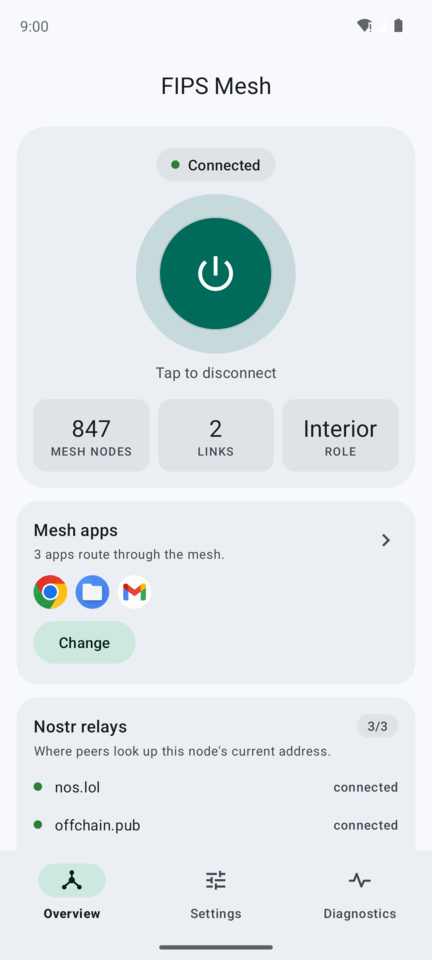
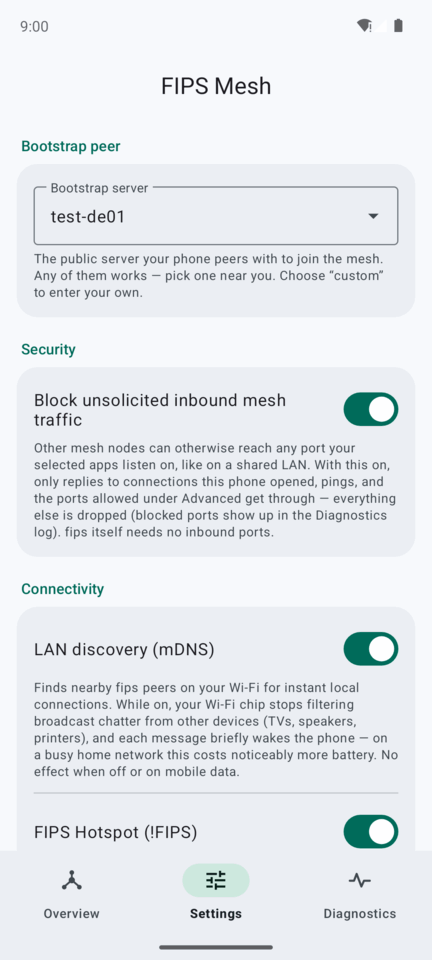
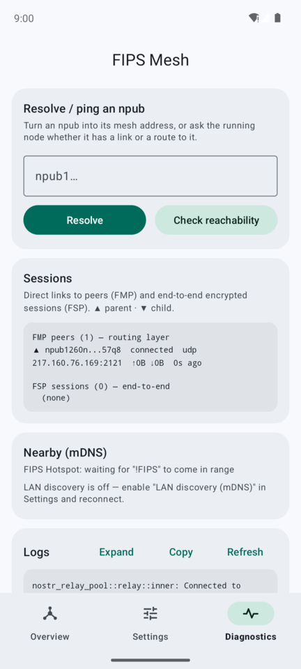
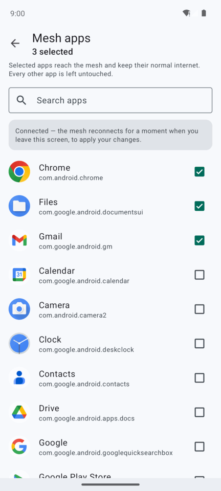
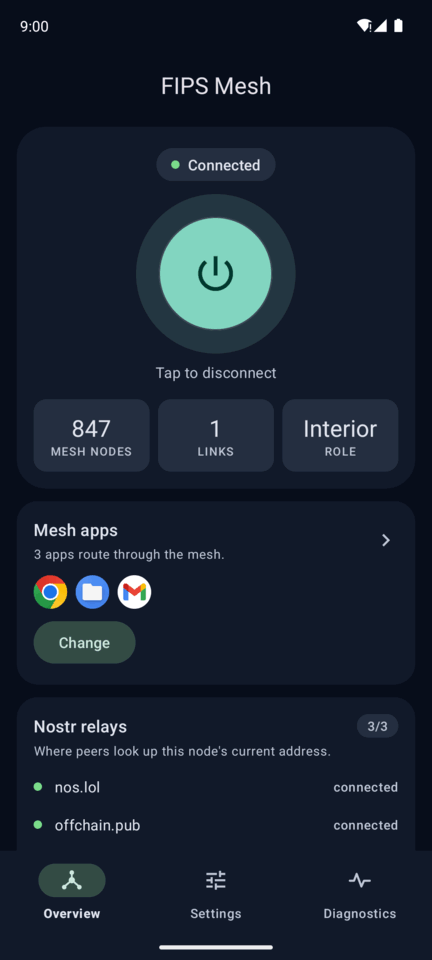
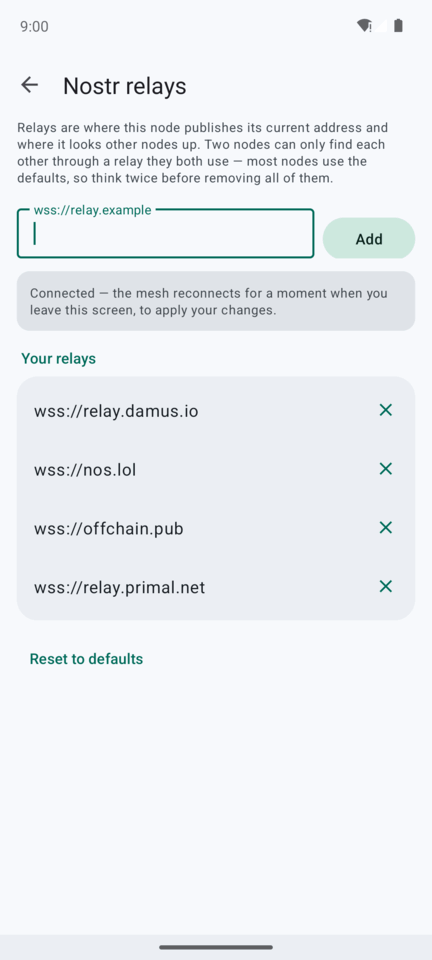

# fips2go

Android port of [FIPS](https://github.com/jmcorgan/fips): the mesh daemon
embedded in a `VpnService` app. Selected phone apps reach the mesh over
`fd00::/8` with `.fips` DNS while keeping normal internet (per-app split
tunnel with a userspace forwarder).

## Screenshots

| Overview | Settings | Diagnostics | Mesh apps |
|---|---|---|---|
|  |  |  |  |

| Dark mode | Nostr relays |
|---|---|
|  |  |

<sub>Captured on the x86_64 emulator, joined to the live public mesh.</sub>

## Features

Beyond running a fips node on the phone, the app is what makes that node
usable on a device you also use for everything else.

- **Per-app split tunnel.** You pick which apps reach the mesh. Those apps get
  the mesh **and** normal internet — clearnet traffic rides a userspace
  forwarder on sockets protected from the tunnel — and every other app on the
  phone is untouched. With nothing selected the tunnel captures only fips2go
  itself, so it does nothing. Change the selection while connected and the
  mesh reconnects for a moment to apply it — no manual reconnect.
- **`.fips` names just resolve.** Covered apps' DNS is intercepted in-process:
  `.fips` names are answered by the built-in resolver, everything else goes to
  your normal upstreams. A `.fips` hostname works in the browser with nothing
  to configure.
- **Mesh names.** An address book on Overview maps readable names to npubs —
  `home.fips` instead of `npub1k3ae….fips` — for every mesh app, like a hosts
  file (it *is* one: fips's `name npub` format). Names are local to the
  device, and adding or re-pointing one applies to the next lookup; the mesh
  does not reconnect.
- **Default-deny inbound firewall.** Any authorized node on the mesh can
  otherwise reach any port your selected apps listen on, as if you had joined
  a shared LAN. Only replies to connections the phone opened, ICMPv6, and an
  explicit port allowlist get through; blocked ports show up in the log.
- **Identity sealed by the Android Keystore, with backup and restore.** The
  node's secret key is encrypted with a non-exportable Keystore key. Overview
  can reveal it for backup (clipboard flagged sensitive) and take it back
  afterwards — the only way an identity survives an uninstall, since the
  Keystore key dies with the app.
- **FIPS Hotspot.** While connected, the app auto-joins any open Wi-Fi named
  `!FIPS`, anywhere, to reach fips peers on it — your internet stays on your
  normal network. On dual-Wi-Fi phones it joins as a *second*, local-only
  connection without giving up the Wi-Fi you are already on.
- **LAN discovery (mDNS).** Finds fips peers on your Wi-Fi and dials them
  directly, with no relay or mesh hop. The tunnel's own addresses are kept out
  of the adverts, so the mesh ULA is never broadcast on the LAN. It also works
  the other way round: a device **tethered to this phone's own hotspot** that
  runs fips is found and linked over the hotspot LAN, with nothing to set up —
  which is how tethered devices get the mesh. (Android gives an app no way to
  route a tethered client's traffic into the tunnel: the kernel forwards it,
  no app owns it, and tethering never uses a VPN as its upstream.)
- **Survives network changes.** A Wi-Fi↔cellular hand-over keeps the node
  running: sessions, tree position and routes are all kept, and the peers
  whose path moved are re-pinned within about half a second of Android
  reporting the new network (the service pokes fips's medium-change detector
  the moment the callback fires). No restart, no manual reconnect — including
  on IPv4-only CGNAT mobile networks, where extra probe routes keep AAAA
  lookups (and so `.fips` names) resolving. Only two network events still
  restart the node: an underlay whose IPv6 status differs from the last one,
  and a FIPS Hotspot joining or leaving. (Changing the mesh apps or the relay
  list while connected restarts it too, once, because you asked.)
- **Your choice of Nostr relays.** The node publishes its address to, and looks
  peers up on, fips's three default relays out of the box. Add your own or
  remove any of them from Overview; addresses are validated before they are
  saved, because one the relay client rejects would take the whole rendezvous
  down with it.
- **Diagnostics that answer the real questions.** Resolve or ping an npub,
  live peer sessions with byte counts, nearby mDNS sightings, which Nostr
  relays the node is actually connected to, and a log viewer you can expand
  and copy.
- **In-app updates.** Checks GitHub Releases, downloads the APK matching your
  device's ABI, verifies it against the release's sha256, and hands it to the
  system installer — which enforces the release signing key and refuses while
  the VPN is up. Identity and settings survive.
- **Zero-config first run.** A fresh install connects without opening
  Settings: a bootstrap peer and working defaults are seeded on first launch.
  (Android's *Always-on VPN* is deliberately not supported: the app declares
  so, and the toggle is greyed out in system settings. Connect from the app.)
- **Battery-aware.** A saver profile relaxes the maintenance tick and halves
  heartbeats, measured at ~40% less idle CPU; the packet pump idles at
  essentially zero wakeups.

Standalone repo — it depends on fips as a pinned **git dependency**
(`fr34aky/fips` @ `android-hooks`, upstream v0.5.1+ plus the small embedder
hooks: socket-protect, `TunPacketProcessor`, public `ControlReadHandle::query`,
`ControlCommandHandle` for socket-less connect/disconnect, the `show_lan_peers`
mDNS-sightings query, dial-scoped UDP instances for the hotspot, and a
`NetmonTrigger` to wake the medium-change detector), so it clones and builds
without a sibling fips checkout.

## Layout

| Path | What |
|---|---|
| `shim/` | Rust cdylib `libfips_android.so`: engine (node lifecycle), TUN fd pump, DNS proxy, clearnet forwarder, JNI surface (`org.fips.android.FipsNative`). |
| `android/` | The Kotlin app (Material 3, bottom-nav): Overview / Settings / Diagnostics, `FipsVpnService` (per-app split tunnel, protect callback, foreground service). |
| `smoke/` | Two-node host smoke test of the embedding seam. |
| `android-env.sh` | Cross-build env: NDK r27c paths + the `LIBCLANG_PATH` fix for host builds. |
| `build-native.sh` | Builds the shim for every supported ABI and copies the `.so`s into `android/app/src/main/jniLibs/<abi>/`. |

## Supported platforms

| ABI | Rust target | Devices |
|---|---|---|
| `arm64-v8a` | `aarch64-linux-android` | Every 64-bit ARM phone/tablet (~2016+); the primary, on-device-verified target. |
| `armeabi-v7a` | `armv7-linux-androideabi` | Old 32-bit phones. Compiles and packages; not exercised on real 32-bit hardware. |
| `x86_64` | `x86_64-linux-android` | Android emulator, Chromebooks. Emulator-verified: connect, VPN establish, and a live mesh link + npub resolve against a host-side fips daemon reached via `10.0.2.2`. |

The debug APK packages all three. Releases ship **one APK per ABI**, plus a
universal APK containing all three for anyone who would rather not work out
which one they need (see [Release build](#release-build)). min SDK 26
(Android 8.0).

## Prerequisites

- Rust 1.94.1 with the Android targets (all pinned in `rust-toolchain.toml`;
  `rustup target add aarch64-linux-android armv7-linux-androideabi
  x86_64-linux-android` if rustup doesn't auto-install them).
- Android NDK r27c (paths in `android-env.sh`).
- JDK 17, Android SDK (platform-34, build-tools 34) + Gradle 8.7.

## Build

```bash
./build-native.sh                          # Rust shim, all ABIs → jniLibs
cd android
JAVA_HOME=~/.local/jdk-17 ~/.local/gradle-8.7/bin/gradle assembleDebug
# → app/build/outputs/apk/debug/app-debug.apk (universal, all three ABIs)
adb install app/build/outputs/apk/debug/app-debug.apk
```

(SDK path in `android/local.properties`; adjust for your machine.)

To iterate on a single platform, pass the ABI(s) to the native build —
Gradle repackages whatever is in `jniLibs/`:

```bash
./build-native.sh arm64-v8a                # physical phone only
./build-native.sh x86_64                   # emulator only
./build-native.sh arm64-v8a x86_64         # both
```

Per-ABI notes:

- **arm64-v8a / x86_64**: `shim/.cargo/config.toml` forces 16 KB
  page-aligned LOAD segments (required on Android 15+ devices and by
  Google's 16 KB-page policy); don't remove those rustflags.
- **armeabi-v7a**: stays 4 KB-aligned (32-bit Android never uses 16 KB
  pages). This is the ABI most likely to surface pointer-width issues in
  the fips dependency — build it before bumping the fips pin.
- **Emulator (x86_64)**: create an AVD on the "Google APIs" x86_64 image
  (API 26+), `adb install` the same APK; the emulator picks the x86_64
  `.so` automatically. To exercise the mesh, run a peer daemon on the host
  (`fips --config <yaml>` with a UDP bind, `tun.enabled: false`) and set
  the app's peer endpoint to `10.0.2.2:<port>` — the emulator's alias for
  the host loopback.

## Release build

```bash
./release-build.sh                # all ABIs + the universal APK
./release-build.sh arm64-v8a      # subset; no universal APK
# → dist/v<versionName>/: one signed APK per ABI + sha256 + unstripped .so,
#   plus fips-android-v<version>-universal.apk + sha256
```

The full release process — version decision, build, GitHub release, Zapstore
publish and credential handling — is in [`RELEASING.md`](RELEASING.md).

Releases ship **one APK per ABI** — `arm64-v8a` is the device-verified one
(see Supported platforms) — **plus one universal APK** carrying all three.
Point first-time installers at the universal APK: it is ~40 MB against ~18 MB
for arm64, but it always installs, whereas picking the wrong per-ABI APK
fails with `INSTALL_FAILED_NO_MATCHING_ABIS`.

The per-ABI APKs are not redundant: the in-app updater selects assets by the
`-<abi>.apk` suffix, so an installed app keeps taking the ~18 MB APK matching
its own device on every update, universal-installed or not (same package, same
signing key, higher `versionCode` — it updates in place). The universal APK's
`-universal` suffix matches no ABI, so the updater never picks it. **Publish
all of them**: dropping the per-ABI assets silently breaks in-app updates for
every already-installed user, since the updater would find no matching asset
and just report "no update".

A partial run (`./release-build.sh arm64-v8a`) skips the universal APK rather
than building one from whatever `jniLibs/` happens to hold, which could be a
stale `.so` from an earlier version.

Signing needs `android/keystore.properties` (gitignored):

```properties
storeFile=/path/to/release.keystore
storePassword=...
keyAlias=fips-android
keyPassword=...
```

Without it the release APK comes out unsigned. The script archives an
unstripped copy of the shim next to the APK for symbolizing native crash
dumps — keep it (and the keystore!) with the release, not in the repo.
`THIRD-PARTY-NOTICES.md` lists everything statically linked into the
binary and is attached to each GitHub release. Bump `versionCode` and
`versionName` together in `android/app/build.gradle.kts` for every release.

## Local fips development

To hack on the fips hooks against a local checkout instead of the pinned
fork, add a patch to `shim/Cargo.toml` (and `smoke/Cargo.toml`):

```toml
[patch."https://github.com/fr34aky/fips"]
fips = { path = "../fips" }   # your local fips checkout on android-hooks
```

## How it works

- **Identity**: generated in Rust (`deriveIdentity`); the nsec is encrypted
  with a non-exportable Android Keystore key (`SecureStore`/`IdentityStore`).
  The node's fips address is the tunnel address.
- **Tunnel**: routes `fd00::/8` plus full clearnet (`0.0.0.0/0`, and `::/0`
  only while the underlay has IPv6 internet; on v4-only underlays two probe
  host-routes — `2000::/128` for netd, `2001:4860:4860::8888/128` for
  Chromium's 60 s-cached reachability probe — keep AAAA queries and thus
  `.fips` names resolving) for the captured apps only, MTU 1280. The TUN fd is dup'd by the shim; a reader
  thread classifies each outbound packet — `fd00::/8` goes through the node's
  own `TunPacketProcessor` (destination filter, MSS clamp, hairpin, ICMPv6;
  byte-identical to the daemon's system-TUN path), everything else to the
  userspace forwarder.
- **DNS**: covered-app DNS is sent to the `fd00::53` sentinel and intercepted
  in the pump. `.fips` names go to the in-process FIPS responder
  (`[::1]:5354`) — a name from the app's hosts file (`hosts_path`) is first
  re-asked as `<npub>.fips`, and the answer re-issued under the name the app
  used; everything else is forwarded to upstream resolvers over
  protected sockets (SERVFAIL on total failure). Configurable via
  `dns_upstreams`.
- **Socket protection**: the node announces every underlay socket fd to the
  shim's hook, which crosses JNI to `VpnService.protect()`. Covered: UDP
  listen/adopted/connected-peer, TCP listener/accepted/dialed (pre-SYN),
  Nostr STUN/hole-punch. Not covered (no fd in those libraries): nostr-sdk
  relay websockets, mDNS — benign because the fips app itself is not
  captured by the per-app tunnel.
- **FIPS Hotspot** (Settings toggle, on by default; API 29+, needs the fine
  location permission — Android hides SSIDs and scan results without it):
  while connected, the app auto-joins the open SSID `!FIPS` by two paths — a
  `WifiNetworkSuggestion` (API 31+) that the platform auto-joins and roams
  city-wide whenever the primary Wi-Fi slot is free, and a
  `WifiNetworkSpecifier` local-only secondary connection for the dual-Wi-Fi
  case, filed only once a scan actually shows `!FIPS` in range with the
  strongest beacon's BSSID pinned (approval is stored per BSSID, so a known
  AP rejoins with no prompt). The hotspot is never an underlay candidate: on
  join the node is rebound with a *second* UDP transport bound to the hotspot
  address on the main instance's port, dial-scoped to the link subnet, and
  LAN mDNS is forced on for that link.
- **Status**: `FipsNative.status()`/`query()` are served lock-free from the
  node's `ControlReadHandle` snapshots — same data as `fipsctl show_*`.

## Status / caveats

- **Exercised on a device** (Pixel 9 Pro, GrapheneOS / Android). Verified:
  connect/disconnect and joining a live ~1300-node mesh; `.fips` resolution
  and upstream DNS; per-app split tunnel (selected apps get mesh **and**
  clearnet, other apps untouched); automatic Wi-Fi↔cellular hand-over in both
  directions — the node stays up and both peers were re-pinned 0.5 s (to
  LTE) and 0.3 s (back to Wi-Fi) after the network callback, with no link
  lost through the liveness window, including on a roaming IPv4-only CGNAT
  5G network, with `.fips` resolution surviving past Chromium's 60 s
  IPv6-probe window; Keystore identity
  + regenerate; the Material 3 UI (Overview / Settings / Diagnostics), npub
  resolve, and the log viewer; the battery profile (relaxed timers). Also
  unit-tested on the host (engine lifecycle, DNS proxy, packet codecs) and
  cross-compiled for arm64.
- **Battery profile measured** (Pixel 9 Pro, 10-min screen-off idle windows,
  per-thread `/proc` deltas): `battery_saver` cuts the shim's idle CPU ~40%
  (5.5 vs 9.2 ms CPU/s) and process wakeups ~19% (19.3 vs 23.9 wake/s) —
  mostly via the relaxed maintenance tick and halved heartbeats (encrypt
  wakeups 0.6 vs 2.0/s). The pump's former 250 ms stop-flag tick (12 wake/s
  across 3 threads, ~62% of process wakeups) has since been eliminated
  (eventfd in the reader's poll, stop sentinel / channel-close instead of
  recv timeouts): re-measured, the pump now contributes ~0 idle wakeups and
  the process idles at 7.5 wake/s / 3.7 ms CPU per s (was 19.3 / 5.5 before
  the fix, same saver-on conditions). Not yet measured: a full multi-hour
  Doze cycle. The forwarder was validated on a few flows, not under broad
  real-app load.
- mDNS LAN discovery sits behind a Settings toggle, **on by default since
  0.3**, and is live-verified against a fips daemon on the same Wi-Fi: the
  phone discovered the host via `_fips._udp` within ~1.5 min, dialed its LAN
  address directly (no relay/mesh hop), and the advert carried only the
  Wi-Fi address — the tunnel ULA stays off the LAN. The app holds a
  `MulticastLock` while discovery can actually work — the toggle is on and
  the underlay is Wi-Fi, or a FIPS Hotspot is joined (which forces LAN
  discovery on for that link) — and never on cellular: the lock disables the
  chip's hardware multicast filtering, so every LAN multicast frame wakes the
  CPU and chatty LANs cost battery. Discovery over the phone's **own**
  hotspot needs no lock: with the phone as the access point (underlay
  cellular, lock not held) a laptop running fips on the hotspot was
  discovered and the link came up (Pixel, 0.6.0) — so do not widen the lock
  to cover tethering, it would only cost battery. The tunnel's own addresses are excluded
  from the adverts so the mesh ULA is not broadcast on the LAN. mDNS sockets
  cannot be socket-protected (no fd access) — fine for the per-app split
  tunnel, non-functional under "Block connections without VPN". BLE/Ethernet
  transports are not available on Android. ICMP to clearnet is not
  forwarded (TCP/UDP are).
- Signed per-ABI releases are published on GitHub Releases, and the app can
  update itself: *Check for updates* (Diagnostics) downloads the ABI-matching
  APK, verifies it against the release's sha256, and hands it to the system
  installer — which only proceeds with the VPN disconnected and enforces the
  release signing key (identity and settings survive; verified live by
  updating v0.1.2 → v0.1.3 from within the app). Only `arm64-v8a` has been
  exercised on real hardware.

## License

MIT (see `LICENSE`). The bundled native library statically links
[fips](https://github.com/jmcorgan/fips) (MIT, © Johnathan Corgan) and other
MIT/Apache-2.0 Rust crates — binary releases should ship their notices.
